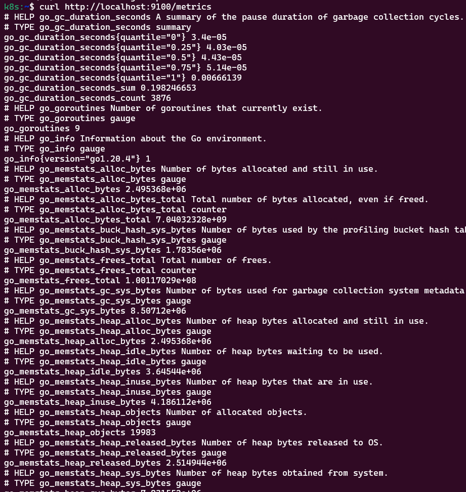

View Prometheus node exporter enpoint /metrics 
```bash 
k port-forward pod/kube-prometheus-stack-prometheus-node-exporter-25zs8  9100:9100
curl http://localhost:9100/metrics
```



Rule for record the time series :
``` k exec -it prometheus-kube-prometheus-stack-prometheus-0 -- sh  
/etc/prometheus/rules/prometheus-kube-prometheus-stack-prometheus-rulefiles-0/..2023_07_14_07_12_39.219992205/default-kube-prometheus-stack-node-exporter.rules-2127310a-7934-44e8-92fb-02003704aeec.yaml```
Example of the mertic : node_cpu_seconds_total 
```
groups:
- name: node-exporter.rules
  rules:
  - expr: |-
      count without (cpu, mode) (
        node_cpu_seconds_total{job="node-exporter",mode="idle"}
      )
    record: instance:node_num_cpu:sum
  - expr: |-
      1 - avg without (cpu) (
        sum without (mode) (rate(node_cpu_seconds_total{job="node-exporter", mode=~"idle|iowait|steal"}[5m]))
      )
    record: instance:node_cpu_utilisation:rate5m
  - expr: |-
      (
        node_load1{job="node-exporter"}
      /
        instance:node_num_cpu:sum{job="node-exporter"}
      )
    record: instance:node_load1_per_cpu:ratio
  - expr: |-
      1 - (
        (
          node_memory_MemAvailable_bytes{job="node-expo
```